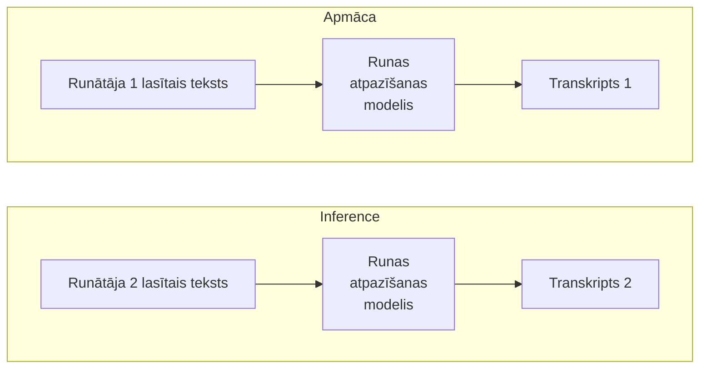
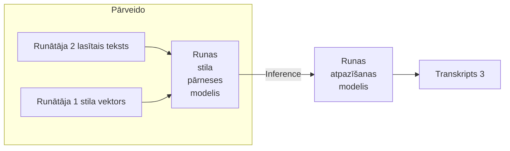

```mermaid
flowchart LR
    subgraph id2[Inference]
    direction LR
    D[Runātāja 2 lasītais teksts] --> E["Runas 
    atpazīšanas 
    modelis"] --> F[Transkripts 2]
    end
    
    subgraph 0i1[Apmāca]
    direction LR
    A[Runātāja 1 lasītais teksts] --> B["Runas 
    atpazīšanas 
    modelis"] --> C[Transkripts 1]
    end
    
    
    
```

```mermaid
flowchart LR
    subgraph zid[Pārveido]
    direction LR
    id2[Runātāja 2 lasītais teksts] --> id3["Runas 
    stila
    pārneses 
    modelis"]
    id0[Runātāja 1 stila vektors] --> id3
    end
    
    id3 -- Inference --> id5["Runas 
    atpazīšanas 
    modelis"] 
    
    id5["Runas 
    atpazīšanas 
    modelis"] --> id4[Transkripts 3]
    
```
Mērķis: samazināt CER/WER Transkriptam 3 attiecībā pret Transkriptu 2

STT - Speech to text

SST - Speech style transfer